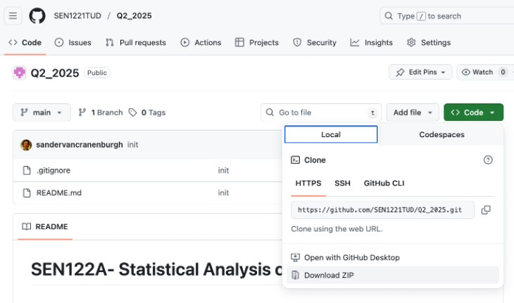
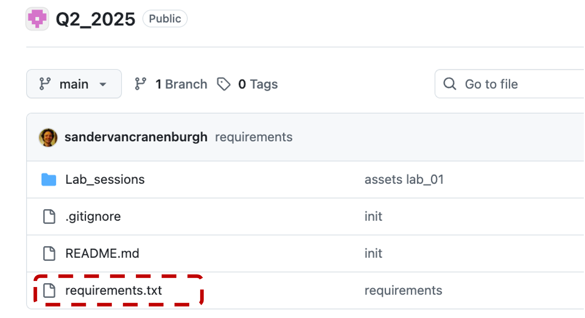
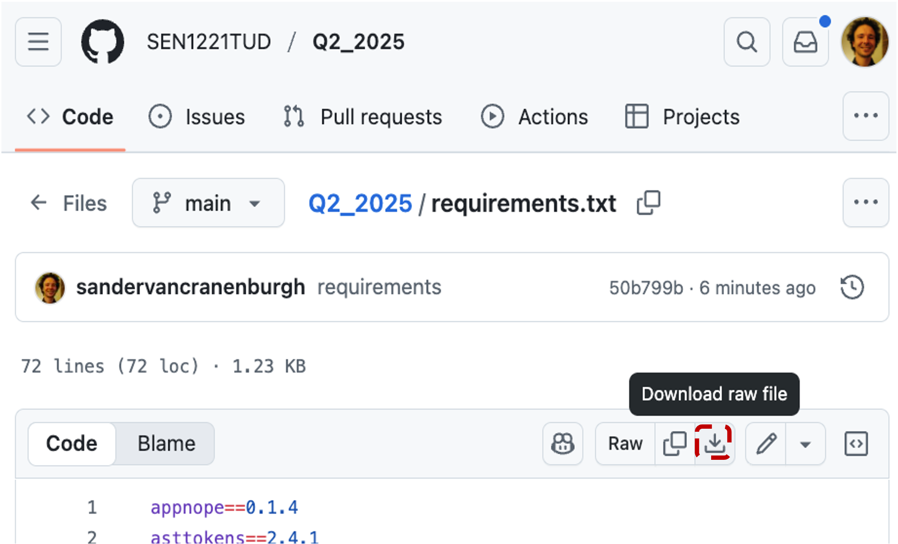
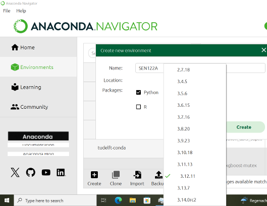
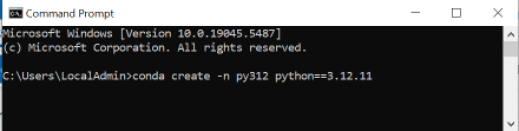
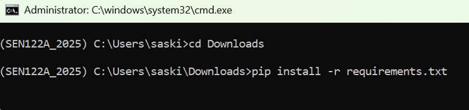
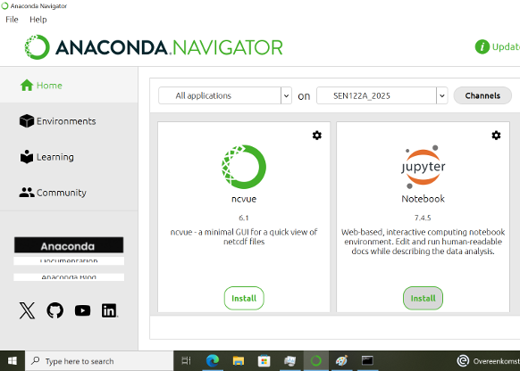
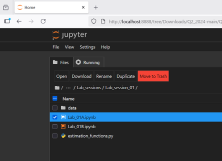

# SEN1721- Travel Behaviour Research 2025
## *Latent Class discrete choice models*


## 1. Introduction

Welcome to the *Latent class model* section of the SEN1721 course repository. In this repository, you will find Jupyter notebooks for the in-class assignments, step-by-step instructions for setting up your Python environment, and a discussion forum where you can ask questions related to the course content.
   

## 2. Course description

Mathematical models of choice behaviour –henceforth referred to as "Discrete Choice Models" (DCMs)– are widely used to study the decision-making behaviour of individuals across numerous domains, including transportation, marketing, and health. DCMs are used to infer preferences over attributes and alternatives and predict the impact of new policies.

This part of the SEN1721 course aims to equip students in the socio-technical domain with a comprehensive understanding of **latent class choice models**. You will learn the theoretical underpinnings of thse choice models and gain practical hands-on experience in estimating and applying these models to solve real-world problems.  

## In-class assignments
In-class assignments are offered in the form of Jupyter notebooks and aim to demonstrate and reinforce knowledge about Latent class choice models, the underlying assumptions, estimation techniques, and how to interpret outcomes. They provide **hands-on** experience with the method, which is essential to master it. There are two in-class assignments, which comprise a series of **exercises**.

For the in-class assignments, we use **Python notebooks** (aka Jupyter Notebooks). You have two options to work with them:<br> 
1. Anaconda
2. Pip<br>

For each option, **instructions** to set up your Python environment are given at the **end of this page**.

If you are **unfamiliar with Python**, we recommend completing [**lab session 0**](https://github.com/SEN1221TUD/Q2_2025/blob/main/Lab_sessions/Lab_session_00/lab_session_00.ipynb), which provides the necessary tools to conduct the in-class assignments. It covers topics such as data structures, utilising external libraries, data exploration, visualisation, etc.

### 3.2. In-class assignment publication dates
The In-class assignment and answers will be available on the following dates:

| Week | In-class assignment | Publication date<br>In-class assignment | Publication date<br>Answers |
|:----:|:-------------------:|:--------------------------------------:|:------------------------------------------:|
| 47   | In-class assignment 1 | ⏳ 17-03-2026 09:00 | ⏳ 18-03-2026 09:00 |
| 48   | In-class assignment 2 | ⏳ 17-03-2026 09:00 | ⏳ 19-03-2026 09:00 |
| 49   | In-class assignment 3 | ⏳ 17-03-2026 09:00 | ⏳ 20-03-2026 13:00 |

## 4. Tutorials
Tutorials are supplementary materials, offered to help you deepen your understanding of key concepts in choice modelling. They are **not** considered part of the **mandatory course material** for SEN1721. These ([tutorials](https://github.com/SEN1221TUD/Tutorials)) aim to reinforce your understanding of the topics covered. They do not contain exercises.<br>

Here, you will find tutorials. Tutorials aim to explain concepts that are important to choice modelling. The current list of topics is:

[Tutorial 0](https://github.com/SEN1221TUD/Tutorials/blob/main/tutorial0/tutorial0_errors.ipynb): Debugging common error messages and issues in Python, Pandas and Biogeme<br>
[Tutorial 1](https://github.com/SEN1221TUD/Tutorials/blob/main/tutorial1/tutorial1_DGP_and_bias.ipynb): The data generating process and bias <br>
[Tutorial 2](https://github.com/SEN1221TUD/Tutorials/blob/main/tutorial2/tutorial2_The_loglikelihood_function.ipynb): The loglikelihood function<br>
[Tutorial 3](https://github.com/SEN1221TUD/Tutorials/blob/main/tutorial3/tutorial3_concave_likelihood_MNL.ipynb): The concave likelihood function of the linear-additive RUM-MNL model<br>
[Tutorial 4](https://github.com/SEN1221TUD/Tutorials/blob/main/tutorial4/tutorial4_Local_vs_global_maxima.ipynb): Local versus global maxima<br>
[Tutorial 5](https://github.com/SEN1221TUD/Tutorials/blob/main/tutorial5/tutorial5_Ignoring_panel_structure.ipynb): The impact of ignoring the panel structure of choice data<br>
[Tutorial 6](https://github.com/SEN1221TUD/Tutorials/blob/main/tutorial6/tutorial6_Expected_max_utility.ipynb): The expected maximum utility and the LogSum formula<br>

The list of tutorials may be further extended in the future.

## 5. Q&A forum

We use the [Issues](https://github.com/SEN1721TUD/SEN1721_2026_public/issues) section as the Q&A platform of this course. This is where you can post questions related to lecture content, in-class assignments, or technical issues with Python. Before you create a new issue, please make sure that you check
whether the issue is reported in the [Debugging common error messages and issues in Python, Pandas and Biogeme notebook](https://github.com/SEN1221TUD/Tutorials/blob/main/tutorial0/tutorial0_errors.ipynb). Also, please check whether the same question hasn’t already been raised by one of your peers. You can also contribute to ongoing discussions by commenting on existing issues to continue the conversation or provide additional insights. As an example, we have already created the first issue; see [Issues](https://github.com/SEN1721TUD/SEN1721_2026_public/issues).

To create a new issue (question or problem) in the course repository, follow these steps:

1. Go to the "Issues" section of the course repository.
2. Click on "New issue" in the green button located at the upper right corner of your screen.
3. Add an informative title to your question or problem (e.g., "logit model of BIOGEME does not import in my notebook").
4. Describe your issue clearly and concisely. 
5. Add a topic label from the right-hand side. Click on the gear icon next to "Labels" and choose the label based on the topic of your question. 
6. Click on "Submit new issue" in the green button below the text description.

After that, the lecturer or teaching assistant will reply to your question. Also, you are encouraged to reply to questions posted by your fellow students! If you know how to help your fellow student with an issue, share your thoughts!

## 6. Instructions to set up your workspace

In this section, we will guide you through the configuration of your Python environment for the Discrete Choice Modelling part of the course. You have to set up your environment once. This environment will work for all in-class assignments.

### Setting up Python environment using Anaconda

Anaconda is a popular platform for managing Python environments. It is **strongly** recommended to create a **fresh** environment that uses Python version **3.12.XX**.Other versions of Python, such as **3.10, 3.9 or  older**, are known to give some problems. Also, reusing an environment from another course is a recipe for installation troubles.

Step-by-Step Instructions:


#### A. Download the in-class assignment files

1. **Go** to: [github.com/SEN1721TUD/SEN1721_2026_public](https://github.com/SEN1721TUD/SEN1721_2026_public)

2. **Download the materials**
   - Click the green `Code` button (top right of the file list)
   - In the dropdown, select Download ZIP
   

3. **Locate the ZIP file**
   - By default, the file will be saved in Downloads
   - The file is named: `SEN1721_2026_public-main.zip`

4. **Copy to your course folder**
   - Open File Explorer in Windows (or Finder in Mac).
   - Move the ZIP file to a convenient location, e.g. `Documents/Courses/SEN1721/`

5. **Unpack (extract) the ZIP**
   - Right-click the ZIP file → choose **Extract All...**
   - Inside the extracted folder you should see the subfolders **/In_class_assignments**
      
#### B. Download the requirements.txt file into your Downloads folder 

1. **Go** to: [github.com/SEN1721TUD/SEN1721_2026_public](https://github.com/SEN1721TUD/SEN1721_2026_public)
   
2. In the file list, click on **requirements.txt**

   

3. On the top-right of the file view, click the **Download raw file** icon ()

   

4. The file will be saved to your **Downloads** folder 

5. Check in your **Downloads** folder to confirm the file is there.


#### C. Create an **empty** Python 3.12.XX environment

0. **Install Anaconda**: 
   - Go to the [Anaconda download page](https://docs.anaconda.com/anaconda/install/).
   - Choose the appropriate version and click Download.
   - Run the installer and follow the  instructions.

1. Open **Anaconda Navigator**, then Go to the **Environments**

2. Click **Create:** (bottom left) Do not reuse an old env!!
  
3. Enter a name for yoour environment (e.g., SEN1721_2026) and click **Next**.

4. Tick **Python** and **select** version 3.12.XX from the dropdown

5. Click **Create** and wait (be patient)

   

**IF Python 3.12.XX is Not listed**

1. Open the command line terminal (cmd)

2. Type the following command and press Enter: 
   ```conda create -n py312 python=3.12.11```

   

3. After installing, close and restart Anaconda Navigator

#### D. Install the required Python packages

1. In Anaconda Navigator, LEFT-click the green (image of button) button next to the environment name

2. Choose **Open Terminal**

3. In the terminal, go to your downloads folder:
   ``cd Downloads``

    

4. Install the required packages by typing:
   ``pip install -r requirements.txt``

5. Wait until the installation is finished (be patient)

6. Close the terminal


#### E. Install and launch Jupyter Notebook

1. Go to **Home** (top left)

2. In the dropdown at the top, select the created environment (e.g. SEN1721_2026)

    

3. Scroll through the list or use the search bar to find Jupyter Notebook

4. Click **Install** (be patient)

5. When the installation is complete, the button will change from **Install** → **Launch**.

6. Click **Launch** to start Jupyter by double-clicking the launch button


#### F. Start your in-class assignment

1. After launching **Jupyter Notebook**, a new browser tab will open automatically.

2. In the Jupyter file browser, **navigate to the course folder** where you unpacked the materials (e.g. Documents/Courses/SEN1721/SEN1721_2026_public-main/In_class_assignments).

3. Locate the in-class assignment notebook you want to work on (file ending in .ipynb).

4. **Double-click** the file to open it in a new tab.

5. You can now start running the notebook cells.

    
